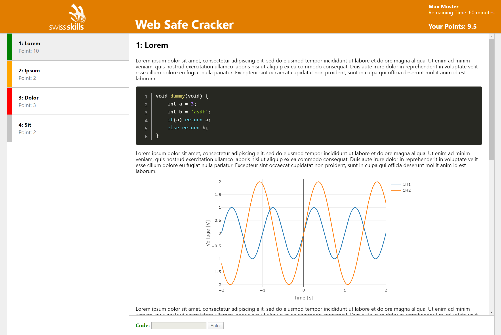

# Web Safe Cracker

This repo contains a web implementation of the safecracker task format using react and django.
Safecracker is a competition where competitors have to solve tasks within a given time.
To solve a task, the competitor needs to infer a code from the task description and enter it (and thus _cracking_ the save).
This implementation was originally developed for a SwissSkills preselection event, but can be used for any kind of competition.



## Dev Setup

### Backend

Make sure you have npm and python 3.7 with pip and virtualenv installed on your system (newer python versions might work, but are not tested).
Clone the repo and run the following commands in the backend-folder:

```
virtualenv venv

. venv/bin/activate                                 # linux bash
venv\Scripts\activate                               # windows powershell

pip install -r requirements_dev.txt

export DJANGO_SETTINGS_MODULE=backend.settings_dev  # linux bash
$env:DJANGO_SETTINGS_MODULE='backend.settings_dev'  # windows powershell

python manage.py migrate
```

Create a superuser by running `python manage.py createsuperuser` with your desired credentials,
then run the backend server with `python manage.py runserver`.
Visit http://localhost:8000/admin and login with your credentials.
You should see the django admin interface, described in the _Usage_-Section below.

### Frontend

In a new terminal (so the backend server continues running), navigate to the frontend folder and execute

```
npm install
npm run start
```

Visit http://localhost:3000 if it did not open automatically.
You should see the login screen for the competitors.

## Usage

### Backend

First, we need to define some necessary settings.
Open _Settings_ in the table _Safecracker_, then add the following values with the _ADD SETTING_ button:

Name | Type | Description 
---- | ---- | -----------
login_window | int(eger) | Length of login-window (in seconds, see explanation below)
task_time | int(eger) | Duration of competition (in seconds, see explanation below)
fail_penalty | dec(imal) | Number of penalty points for blocked task (code entered wrongly twice)  

Type describes the form-field you need to fill in.
E.g. if you have an _int_, you only need to fill in the fields _Key_ and _Value int_.

#### Tasks

Open _Tasks_ in the table _Safecracker_ to manage the tasks for the competition.
Each task has a number, a title, a code and gives some points if the code was inferred correctly.
The task description allows some basic formatting (text style, lists, tables, ...).
Furthermore, there are special elements, which can be added to to task:

**Images** can be added inline or as a block element.
They need to be uploaded first in the attachments-section (open _Attachments_ in the table _Safecracker_).
The width is a CSS property and can be e.g. in _%_ or _px_.
The path references to the filename of you upload.

**Code Snippets** allow for automatic syntax highlighting in the frontend (language: _C_).
You can remove the line numbering by removing the corresponding CSS class in the HTML code.

**Graphs** need to be created first and stored as a json-file, which can then be uploaded in the attachments and refered to in the dialog.
The backend-folder contains a [jupyter notebook](backend/graph_creator_template.ipynb) with an example on how to create such a graph.
The width is again a CSS property as in the image case above, the height is realized as padding-bottom, thus e.g. values in _%_ are relative to the total width.
A good starting point is a width of 60% and a height of 30%.

In all cases, the rich text editor has icons to add these elements and then shows a placeholder only.
To change them later, either delete and re-insert them or edit the underlying HTML in the editor.  

#### Competitors

Open _Competitors_ in the table _Safecracker_ to manage the competitors.
Each competitor has a name, an internal number and a secret login-code (which needs to be unique).
_Task start_ describes the time at which the competitor can login.
From this time on, the competitor has _login_window_ seconds to login into the system.
Once logged in (the exact time is stored as _Login_time_), the competitor has _task_time_ seconds to solve the tasks.
Competitors can re-login if they e.g. accidentally close the browser window, the time is measured from the first login. 

There is also the possibility to upload a csv file with multiple competitors at once, see the [template](backend/competitors_template.csv) for an example.

#### Statistics

After the competition, you can download a csv file containing the points of all candidates in the _Answers_-table.
Furthermore, for a specific candidate in the _Competitors_-table, you can download a list of all his actions, including login, code entering and task view. 

### Frontend

The frontend is pretty much straight-forward.
Competitors can login with the given code, view tasks, enter codes and see their total points and remaining time.
The graphs are displayed in a plotly.js-widget. 

## Deployment

The code can be deployed as a Docker image on various clouds / on-premise clusters.
The current configuration is for Azure using app service, a PostgreSQL database and a blob storage account.

To build the docker container, run

```
python manage.py collectstatic  # in backend
npm run build                   # in frontend
docker build -t websafecracker -f <Dockerfile> .
```

Make sure [docker/start.sh](docker/start.sh) has unix style line endings.
In the current setting the container expects the following environment variables:

Name | Description
---- | -----------
DJANGO_SETTINGS_MODULE | python path of django settings module 
ALLOWED_HOST | url of deployed service for django
SECRET_KEY | django secret key
SERVER_NAME | url of deployed service for nginx
DB_HOST | postgresql db host
DB_NAME | postgresql db name
DB_PORT | postgresql db port
DB_USER | postgresql db user
DB_PASSWORD | postgresql db password
STORAGE_ACCOUNT_NAME | azure storage account name
STORAGE_ACCOUNT_KEY | azure storage account key
MEDIA_URL | azure storage account public URL
